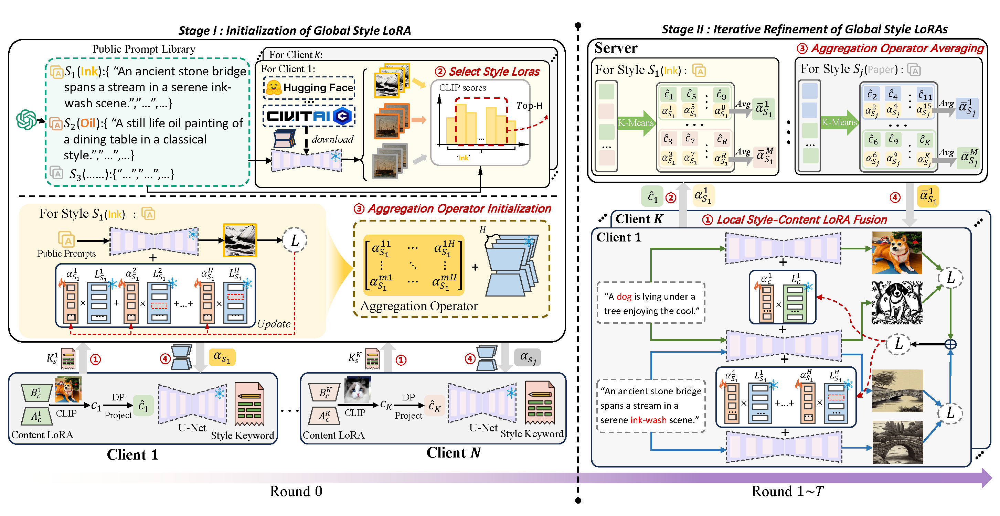

# Fed-DiffLoRA: Personalized Federated Style Transfer for T2I Diffusion Models

This repository provides the official implementation of **Fed-DiffLoRA**, a personalized federated learning framework for style transfer in text-to-image diffusion models.

Fed-DiffLoRA separates **style LoRAs** and **content LoRAs** in a federated setting. Specifically, style-related LoRA parameters can be shared and aggregated across clients, while content-related LoRA parameters remain private on the client side. This design enables privacy-preserving personalized style transfer and high-quality text-to-image generation across distributed clients.



# Installation

To set up the environment, follow these steps:

```bash
conda create -n Fed-DiffLoRA python=3.9
conda activate Fed-DiffLoRA
pip install -r requirements.txt
```

# Data Preparation

Please prepare the style and content images before training.

The expected data structure is:

```bash
Fed-DiffLoRA/
├── style/
│   ├── 1.png
│   ├── 2.png
│   └── ...
├── content/
│   ├── 1.png
│   ├── 2.png
│   └── ...
```

The `style/` folder contains style reference images, while the `content/` folder contains content images used for personalized style transfer.

# Training

Before training, please make sure that the environment has been installed and the data has been prepared.


```bash
python fed_utils/fed_main.py
```


# Inference

After training, generate personalized style-transfer results with:

```bash
python Lora_Refactor/style_content_infer.py
```


# Project Structure

```bash
Fed-DiffLoRA/
├── Content_style_integration/     # LoRA integration and merging modules
├── Lora_Refactor/                 # Style LoRA training, fusion training, and inference
├── fed_utils/                     # Federated learning utilities
├── lora_diffusion/                # LoRA diffusion backbone modules
├── content/                       # Content images
├── style/                         # Style images
├── result/                        # Generated results
├── framework.png                  # Overview of the proposed framework
├── requirements.txt               # Python dependencies
└── README.md
```
